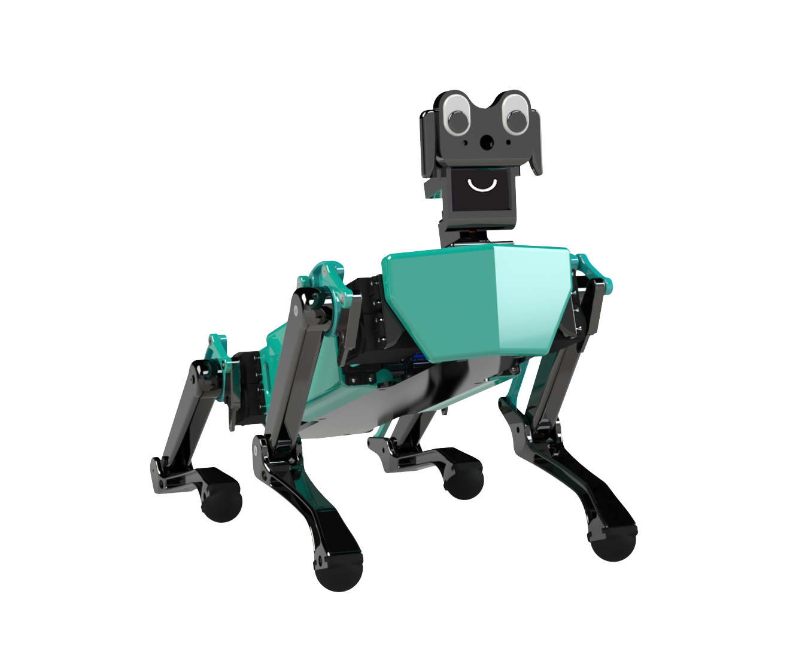
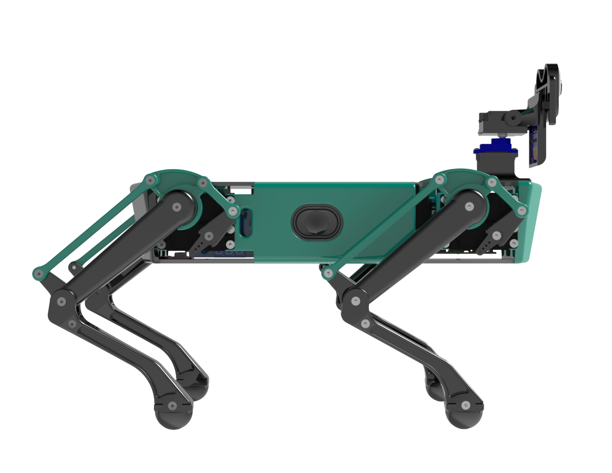

# IBM K9 Quadruped
Group Consultancy Project for IBM.  

Group Members:  
*[Gian-Luca Fenocchi](https://github.com/SpaceBod)*  
*[Louise Davis](https://github.com/ljd20)*  
*[Hamed Mohammed](https://github.com/hamedm15)*  
*[Pablo Romo Gonzalez](https://github.com/pabloromogz)*  
*[Conan Quinlivan](https://github.com/)* 

## Description

K9 is an innovative AI companion pet designed to bring joy, interactivity, and intelligent functionalities into your daily life. Combining advanced technologies such as voice recognition, natural language processing, and integration with popular platforms like Spotify, K9 offers a unique and personalised experience. With its autonomous roaming capabilities, interactive user interface, and expressive OLED display, K9 brings a new level of interactivity and entertainment. Whether it's playing your favorite music, providing real-time news updates, or engaging in natural conversations, K9 is the perfect companion that combines cutting-edge technology with a touch of personality. With its customisability and commitment to sustainability and ethical design, K9 is not just a robot, but a delightful addition to your daily routine.

Watch the video!  

## Table of Contents

- [Installation](#installation)
- [Usage](#usage)
- [Features](#features)

## Installation

To install and run this project, follow these steps:

1. Clone the repository.
2. Navigate to the project directory.
3. Install Python 3.11.
4. Install the dependencies by running `pip install -r requirements.txt`.
5. Follow the steps in found in section 7 of the [documentation](/Documentation.pdf).

## Usage
After adding all necessary API keys to the [settings file](chat-bot/settings.json), you can then run:

`python chat-bot/main.py`

(ensure a game controller is paired to the Raspberry Pi)

## Features

### Voice Recognition and Natural Language Processing

K9 utilizes advanced speech recognition and natural language processing techniques to understand and respond to user commands and queries.

### Spotify Integration

K9 seamlessly integrates with Spotify's Web API, allowing users to control music playback, search for songs, artists, albums, and playlists, and enjoy personalized music experiences.

### Interactive User Interface

K9 features an intuitive and interactive user interface, enabling users to interact with the robot using voice commands and receive visual feedback through the OLED display.

### Autonomous Roaming

K9 is equipped with sensors and algorithms that enable it to autonomously navigate and explore its environment, making it capable of independent movement and exploration.

### Emotive Display

K9's OLED display is used not only to provide visual feedback but also to display expressive animations, including a mouth animation synchronized with its spoken responses, adding a touch of personality to the robot.

### Customisability

The design and architecture of K9 allow for customisation and expansion. Users can add new features, modify existing functionalities, and tailor K9's behavior according to their preferences and requirements.

### Game Controller Integration

K9 can be manually controlled using a game controller, giving users the flexibility to switch between autonomous mode and manual control whenever desired.

### Real-Time News and Weather Updates

K9 can provide real-time news updates and weather forecasts, keeping users informed and up to date with the latest information.

### Text-to-Speech (TTS)

K9 incorporates text-to-speech technology, provided by ElevenLabs, enabling it to convert text into spoken words. This allows K9 to effectively communicate with users and provide audible responses.

### Google Calendar

K9 can access your personal calendar, reading you upcoming events and adding events on request.
