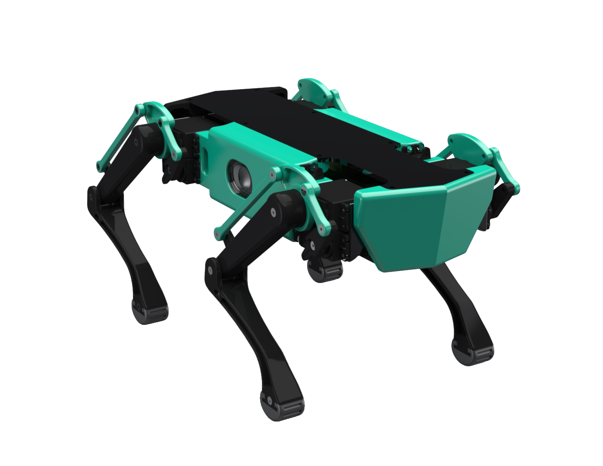

# K9AI
Group Consultancy Project for IBM.

## Features
The chat bot utilises a neural network to find the "intent" behind all quereies given by the user. Therefore, the chat bot will undersand your query.
- Can say greetings
- Can ask for weather, including other cities/countries
- Can ask for the time of day
- Can ask for the week day/date
- Can tell it to shut down
- Can ask it to play a song, playlist, liked songs
- Can ask it to play/pause/skip/previous
- Can ask it to turn up/down/set volume level
- Can ask for news headlines
- Can add events to calendar
- Can provide mental support
